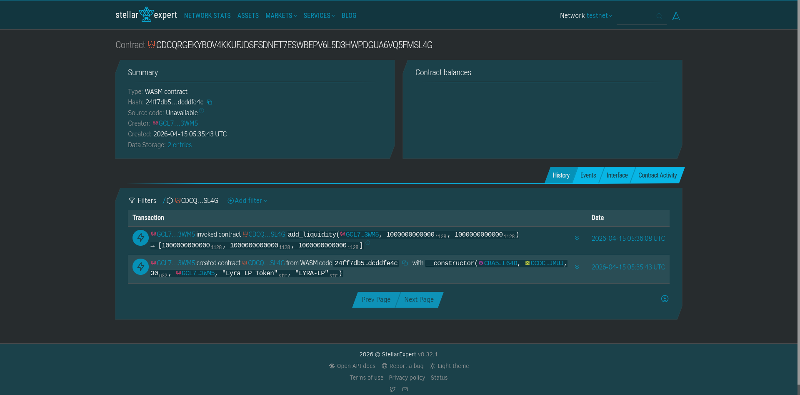

# LyraSwap (Soroban AMM)

LyraSwap is a production-grade, single-pair Soroban DEX contract that implements:

- Constant-product AMM (`x * y = k`) Pair architecture
- OpenZeppelin standard `FungibleToken` and `FungibleBurnable` behavior for LP pairs (LP tokens can be freely transferred and managed by Stellar wallets)
- OpenZeppelin `Ownable` administration for secure fee management
- Robust `__constructor` instantiation per trading pair
- Exact-in swaps only (`swap_exact_in`)
- Max trading fee hardcap at 3% (300 basis points)

Intentionally excluded in v1:

- Multi-pool dynamic routing (this contract represents exactly ONE pair to match Uniswap V2 principles)
- Exact-out swaps
- Protocol fee treasury
- Deadline parameters
- Pause/emergency controls
- Upgrade flow

## Project Overview: The On-Chain AMM Pair

LyraSwap is a decentralized automated market maker (AMM) built on Stellar Soroban for a single token pair. It gives liquidity providers and traders a transparent, auditable market where pricing follows the constant-product model.

For teams that need a focused and reliable on-chain swap pair, LyraSwap provides a clean contract surface for deployment, liquidity provisioning, and exact-in swaps while keeping operations verifiable on the public ledger.

## Project Description: How It Works

LyraSwap follows a straightforward pool lifecycle:

1. Pair deployment: The contract is deployed with `token_a`, `token_b`, `fee_bps`, and owner metadata through `__constructor`.
2. Liquidity provisioning: Providers call `add_liquidity` to deposit both assets and receive LP tokens.
3. Trading: Traders call `swap_exact_in` to swap one token for the other with configurable slippage protection.
4. Liquidity withdrawal: LP holders call `remove_liquidity` to burn LP and receive their proportional reserves.

## Project Vision

- Fair market access: Anyone can interact with the pool under the same deterministic AMM rules.
- Transparent execution: Pool reserves and swaps are fully inspectable on-chain.
- Low-friction DeFi primitive: A minimal single-pair architecture suitable for learning, prototyping, and extension.
- Secure administration: Owner-only fee updates with a strict fee cap.

## Key Features

### Constant-Product Pricing

Swap pricing follows `x * y = k` with exact-in swap support.

### LP Token Standard Compatibility

LP balances use OpenZeppelin `FungibleToken` and `FungibleBurnable` behavior for wallet compatibility.

### Constructor-Based Pair Initialization

The pair is initialized once at deployment using `__constructor`, preventing repeated initialization.

### On-Chain Event Traceability

Liquidity and swap actions emit events, creating a durable on-chain activity trail.

## Deployed Smart Contract Details

### Public Pair Contract ID (Testnet)

`CDCQRGEKYBOV4KKUFJDSFSDNET7ESWBEPV6L5D3HWPDGUA6VQ5FMSL4G`

### Live Deployment Screenshot

Below is the deployment/interaction snapshot provided for this project:



## Future Scope

1. [ ] Multi-pool factory support for deploying many pairs from one orchestrator contract.
2. [ ] Protocol fee routing to a treasury contract.
3. [ ] Exact-out swaps and router helpers.
4. [ ] Deadline and permit-style UX improvements.
5. [ ] Analytics hooks for TWAP, volume, and LP performance dashboards.

<p align="center">
  <i>"Transparent liquidity turns market activity into verifiable infrastructure."</i>
</p>

<div align="right">
  <b>SYSTEM: LYRASWAP | ENGINE: STELLAR SOROBAN</b>
</div>

## Project Structure

```text
.
├── contracts
│   └── lyraswap
│       ├── Cargo.toml
│       └── src
│           ├── lib.rs
│           └── test.rs
├── Cargo.toml
└── README.md
```

## Build and Test

From the project root:

```bash
cargo fmt
cargo test --manifest-path=Cargo.toml
cargo build --target wasm32v1-none --release
```

## Soroban CLI Usage

You can deploy and invoke a `LyraSwap` Pair using `soroban-cli` locally or on testnet.

### 1. Build the Contract

```bash
stellar contract build
```

This produces `target/wasm32v1-none/release/lyraswap.wasm`.

### 2. Deploy

Deploy the wasm binary to your chosen network to get a Contract ID.

```bash
stellar contract deploy \
  --wasm target/wasm32v1-none/release/lyraswap.wasm \
  --source admin \
  --network testnet
```

### 3. Initialize the Pair

Because the contract uses the `__constructor` initialization pattern, you shouldn't call a separate `initialize` method. If deploying with the constructor, provide the args directly during deployment:

```bash
stellar contract deploy \
  --wasm target/wasm32v1-none/release/lyraswap.wasm \
  --source admin \
  --network testnet \
  -- \
  --token_a <TOKEN_A_ID> \
  --token_b <TOKEN_B_ID> \
  --fee_bps 30 \
  --owner <OWNER_ADDRESS> \
  --token_name "Lyra LP Token" \
  --token_symbol "LYRA-LP"
```

### 4. Provide Liquidity

```bash
stellar contract invoke \
  --id <CONTRACT_ID> \
  --source provider \
  --network testnet \
  -- \
  add_liquidity \
  --provider <PROVIDER_ADDRESS> \
  --amount_0_opt 10000000 \
  --amount_1_opt 10000000
```

### 5. Swap

```bash
stellar contract invoke \
  --id <CONTRACT_ID> \
  --source trader \
  --network testnet \
  -- \
  swap_exact_in \
  --trader <TRADER_ADDRESS> \
  --token_in <TOKEN_IN_ID> \
  --amount_in 100000 \
  --min_amount_out 90000
```

## Testnet Deployment Process and Result

The following is a real deployment and liquidity provisioning run that used:

- Wallet: `GCL7GTFA6QDO7C2ERCXNL5J5APZMVXHE4OF63G3QDKFAYQAFNUBX3WM5`
- Source account alias: `waxarsatia`
- TokenA: `CBA5ZCSQYGLCJ7KRLBWDDOJ2BWU7N2GJ4SQSHULF76X6CRJH7ZSLL64D`
- TokenB: `CCDC5U3OC7RXWGUG3ZSK7SB7JHDCY5RVXUKI3IN5JK4KC6PDJ5XWJMUJ`
- Network: `testnet`

### 1. Build

```bash
stellar contract build
```

### 2. Deploy With Constructor Args

```bash
stellar contract deploy \
  --source-account waxarsatia \
  --network testnet \
  --wasm target/wasm32v1-none/release/lyraswap.wasm \
  -- \
  --token_a CBA5ZCSQYGLCJ7KRLBWDDOJ2BWU7N2GJ4SQSHULF76X6CRJH7ZSLL64D \
  --token_b CCDC5U3OC7RXWGUG3ZSK7SB7JHDCY5RVXUKI3IN5JK4KC6PDJ5XWJMUJ \
  --fee_bps 30 \
  --owner GCL7GTFA6QDO7C2ERCXNL5J5APZMVXHE4OF63G3QDKFAYQAFNUBX3WM5 \
  --token_name "Lyra LP Token" \
  --token_symbol "LYRA-LP"
```

Deploy result:

- Contract ID: `CDCQRGEKYBOV4KKUFJDSFSDNET7ESWBEPV6L5D3HWPDGUA6VQ5FMSL4G`
- Tx: https://stellar.expert/explorer/testnet/tx/abf8f4c070d979c5d903939ee7a2d3f59146f01b316d65935dcf7e69084e3903

### 3. Add Liquidity (100000 TokenA + 100000 TokenB)

Both tokens use `7` decimals, so `100000` tokens equals `1000000000000` raw units.

```bash
stellar contract invoke \
  --id CDCQRGEKYBOV4KKUFJDSFSDNET7ESWBEPV6L5D3HWPDGUA6VQ5FMSL4G \
  --source-account waxarsatia \
  --network testnet \
  --send yes \
  -- \
  add_liquidity \
  --provider GCL7GTFA6QDO7C2ERCXNL5J5APZMVXHE4OF63G3QDKFAYQAFNUBX3WM5 \
  --amount_0_opt 1000000000000 \
  --amount_1_opt 1000000000000
```

Add liquidity result:

- Tx: https://stellar.expert/explorer/testnet/tx/e85ea2d626134dc6fe515f0ca01e8570bc0dde0a686350851fbc808aaaa6e8e4
- Event summary: liquidity added with `amount_0=1000000000000`, `amount_1=1000000000000`, `lp_minted=1000000000000`

### 4. Verification

Post-deployment state checks:

- Wallet TokenA balance: `9000000000000` raw units (`900000` TokenA)
- Wallet TokenB balance: `9000000000000` raw units (`900000` TokenB)
- Pool reserves: `reserve_0=1000000000000`, `reserve_1=1000000000000`
- LP balance (wallet): `1000000000000`

## Math Overview

- **Added Liquidity (`add_liquidity`)**:
  - Initial minted LP is $ \sqrt{Amount*{A} \cdot Amount*{B}} $
  - Subsequent LP is minted proportionally: $ \min(\frac{Amount*{A} \cdot TotalLP}{Reserve*{A}}, \frac{Amount*{B} \cdot TotalLP}{Reserve*{B}}) $.
- **Swap Execution (`swap_exact_in`)**:
  - Out = $ \frac{Amount*{in} \cdot (10000 - FeeBps) \cdot Reserve*{out}}{Reserve*{in} \cdot 10000 + Amount*{in} \cdot (10000 - FeeBps)} $.
